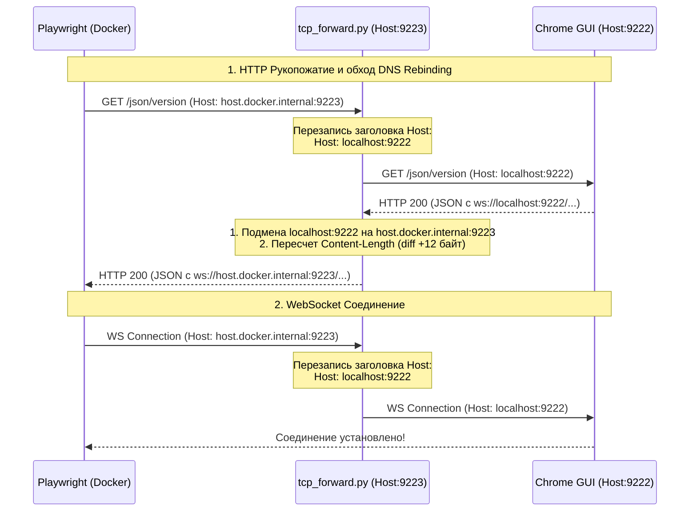

# Contextus 2.0 — Интерактивный режим браузера (HITL) и CDP-туннелирование

В рамках текущего этапа разработки была полностью решена проблема интеграции докеризированного бэкенда с интерактивным GUI-браузером Chrome, запущенным на хост-машине. Это позволяет пользователю вручную проходить капчи и авторизацию (Human-in-the-Loop), сохраняя при этом автоматизацию со стороны ИИ-агента.

---

## 1. Проблемы и архитектурные вызовы

При попытке связать Docker и Chrome с GUI возникли следующие сложности:
1. **Нестабильность X11-forwarding в Docker:** Попытка пробросить X11-сокет (`/tmp/.X11-unix`) и отрисовывать GUI внутри контейнера приводила к частым сбоям, проблемам с правами доступа к X-серверу и падениям.
2. **Ограничения Chrome CDP Bind:** Запуск Chrome с флагом `--remote-debugging-address=0.0.0.0` игнорируется современными версиями браузера из соображений безопасности. Он продолжает слушать строго на `127.0.0.1:9222`.
3. **Защита Chrome от DNS Rebinding:** При попытке проксирования или прямого обращения из контейнера по имени хоста (например, `host.docker.internal:9222`), Chrome отклоняет запросы с ошибкой `500: Host header is specified and is not an IP address or localhost`.
4. **Проблема WebSocket рукопожатия (Upgrade):** Playwright при подключении выполняет два шага: сперва делает HTTP GET запрос для получения метаданных, а затем устанавливает постоянное WebSocket соединение. Защита Host-заголовков срабатывает на обоих этапах.
5. **Рассинхронизация длины контента (Content-Length):** При подмене адресов внутри HTTP-ответов (с `localhost:9222` на `host.docker.internal:9223` для корректной маршрутизации WebSocket в Docker) изменяется размер тела ответа. Без пересчета заголовка `Content-Length` клиенты обрезали JSON-ответы, вызывая ошибки синтаксиса.
6. **Предупреждающая плашка в Chrome:** Использование флага `--disable-blink-features=AutomationControlled` вызывало появление желтой предупреждающей полосы вверху окна о "неподдерживаемом флаге", что мешало обзору и визуальной чистоте.

---

## 2. Реализованное решение: Схема Host-CDP-Tunnel

Вместо сложного и нестабильного проброса графического сервера внутрь контейнера, была реализована схема с **делегированием GUI на хост-систему через кастомный умный TCP-туннель**.

### Компоненты системы:

1. **`tcp_forward.py` (Хост, порт 9223):**
   * Легковесный TCP-прокси на чистом Python, работающий в многопоточном режиме.
   * **Исправление Host Header:** Автоматически перехватывает все пакеты от Docker-клиента и заменяет заголовок `Host: host.docker.internal:9223` (или любой другой) на `Host: localhost:9222`, обходя встроенную блокировку Chrome.
   * **Маршрутизация WebSocket:** Перехватывает ответы Chrome на `/json/version` и подменяет локальный адрес отладчика (`localhost:9222`) на адрес форвардера (`host.docker.internal:9223`), чтобы WebSocket-клиент шел в туннель, а не пытался подключиться к localhost внутри докера.
   * **Коррекция длины тела (Content-Length):** Парсит HTTP-заголовки ответов, вычисляет разницу в размере измененных URL и динамически обновляет заголовок `Content-Length`.
2. **`run_real_chrome.sh` (Хост, порт 9222):**
   * Запускает Chrome на хосте с выделенной папкой профиля `~/.config/contextus-chrome` (не конфликтует с основным браузером).
   * Использует флаги для скрытия автоматизации и блокировок фонового засыпания вкладок.
   * **Устранение плашки предупреждения:** В аргументы добавлен флаг `--test-type`, который скрывает сообщение о неподдерживаемых флагах командной строки.
   * Автоматически поднимает `tcp_forward.py` в бэкграунде.
3. **`start.sh` (Мастер-скрипт оркестрации):**
   * Точка входа для запуска всей системы.
   * Запускает `run_real_chrome.sh`, ожидает доступности порта дебаггера и стартует контейнеры через `docker compose`.
4. **`backend/agent/browser.py` (Контейнер):**
   * При старте проверяет наличие окружения и автоматически выбирает порт подключения: `9223` (через туннель `host.docker.internal`), если работает в Docker, или `9222` (`localhost`), если запущен напрямую на хосте.
   * При невозможности подключиться к CDP — делает fallback на классический headless-режим внутри контейнера.

---

## 3. Результаты и проверка

* Подключение Playwright из контейнера к реальному браузеру по протоколу CDP успешно выполняется за ~0.2 секунды.
* WebSocket-соединение стабильно удерживает сессию, позволяя управлять вкладками, загружать страницы и считывать DOM.
* Желтая полоса "AutomationControlled" скрыта, браузер выглядит и работает как обычное пользовательское приложение.
* Все изменения зафиксированы в конфигурационных файлах проекта и готовы к использованию.
