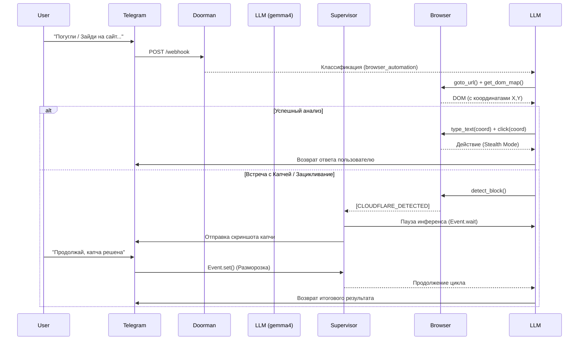

# Итоговая архитектура Contextus 2.0: Multi-Agent & Stealth Web

В этом документе собрана вся логика и структура, которую мы реализовали для создания автономного агента, способного обходить защиты, использовать инструменты и взаимодействовать с человеком.

---

## 1. Концепция и Маршрутизация (Doorman)

Ядром системы является **LLMManager**, который оркестрирует выбор моделей в зависимости от задачи (определяется через легковесную модель-маршрутизатор — **Doorman**).

*   **Doorman (`gemma4-e4b`)**: Первая линия. Анализирует входящий запрос (например: *"Погугли про ЦМАКП"* или *"Зайди на сайт Immunefi"*).
*   **Классификация**: Doorman определяет `task_type` (например, `browser_automation`, `general`, `coding`).
*   **Умное переопределение**: Даже если в веб-интерфейсе отключен тумблер доступа к агенту, бекенд *принудительно* выдаст агенту доступ к инструментам, если задача была классифицирована как `browser_automation` или требующая исследования.
*   **Model Registry (`models.yaml`)**: Подобранный `task_type` направляется в реестр, который выдает самую сильную доступную локальную модель для этой задачи (например, `gemma4-26b` для работы с браузером), обеспечивая автоматический fallback, если модель недоступна.

---

## 2. Инструментарий и Защита от галлюцинаций

После выбора модели, менеджер прикрепляет к ней инструменты через **MCP (Model Context Protocol)**. 

*   **Антигаллюцинационный промпт**: Если инструменты загружены, к модели *жестко* пришивается системный промпт: 
    > `[CRITICAL INSTRUCTION] Тебе доступны инструменты (tools)... НИКОГДА не описывай выполнение текстом и не говори, что у тебя нет доступа к сети — ВСЕГДА вызывай реальные инструменты.`
*   Это гарантирует, что в Telegram или Веб-чате агент не скажет *"Я просто языковая модель и не могу гуглить"*, а молча вызовет нужный MCP-инструмент.

---

## 3. Гибридный Stealth-Браузер (DOM + Vision)

Модуль `browser.py` и MCP-сервер `web-stealth` полностью переработаны для эмуляции поведения реального человека и обхода бот-защит (Cloudflare).

*   **DOM Bounding Boxes**: Инструмент `get_dom_map` не просто возвращает список элементов, он вычисляет физические координаты каждого элемента на экране (`x, y, width, height`) и возвращает только *реально видимые* элементы.
*   **Stealth-Клик (Bezier curves)**: При вызове `click_element` агент больше не стреляет скриптами напрямую в DOM. Он берет Bounding Box элемента, выбирает внутри него случайную точку (смещение от 20% до 85% от краев), **строит плавную кривую Безье** и физически ведет по ней курсор мыши с микро-задержками, после чего делает клик.
*   **Human-like Печать**: Метод `type_text` вводит символы с задержками (0.05с - 0.15с). Каждые несколько символов или после пробелов происходят более длинные "паузы на подумать" (до 0.6с).
*   **Авто-Детект Блокировок**: Если после навигации страница содержит Cloudflare или капчу, инструмент сразу бьет тревогу: `[CLOUDFLARE_DETECTED]`.

---

## 4. Supervisor и Human-in-the-Loop (HITL)

В цикл исполнения (Tool Execution Loop) внедрена логика надзора (**Supervisor**) и Машина состояний сессии (`SessionManager`).

### Как работает Supervisor:
1.  Следит за историей вызовов инструментов (Tool Call History).
2.  Если модель зациклилась (вызвала один и тот же инструмент 3 раза подряд) или встретила ошибку `[CLOUDFLARE_DETECTED]`, Supervisor вмешивается.
3.  Он **блокирует** исполнение (ставит сессию в статус `WAITING_FOR_HUMAN`).
4.  Делает скриншот заблокированной страницы.

### Взаимодействие с Telegram (HITL):
1.  **Фоновый монитор** отлавливает заблокированные сессии.
2.  Агент отправляет вам в Telegram сообщение со скриншотом: *"⚠️ Сессия заморожена (Требуется вмешательство): Обнаружено зацикливание / Капча"*.
3.  Весь цикл инференса LLM ставится на паузу (через `asyncio.Event`).
4.  Вы решаете проблему (или даете подсказку текстом) прямо в ответ на это сообщение в Telegram.
5.  Система перехватывает ваш ответ, добавляет его в контекст модели (`[ОТВЕТ ОТ ЧЕЛОВЕКА]: ...`), мгновенно **размораживает** сессию, и агент продолжает работу с того же места!

---

## 5. Коммуникация и Стабильность
*   **Telegram Streaming**: Функция `send_telegram_message` автоматически разбивает длинные технические отчеты (более 4000 символов) на несколько последовательных сообщений. Telegram больше не отклоняет их с ошибкой `400 Bad Request`.
*   **Изоляция**: Каждая сессия (Session State) привязана к `chat_id` пользователя, что позволяет вести несколько параллельных независимых HITL-процессов.

## Как элементы взаимодействуют (Workflow)

